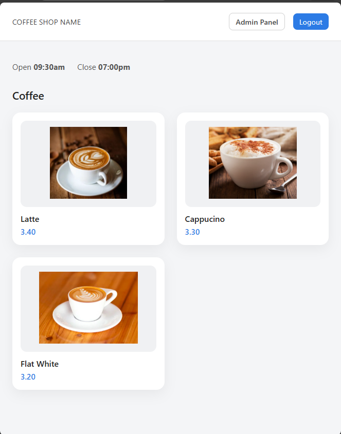

# Just Chilling and Learning 📚💻

A simple coffee shop web app that displays available drinks.
Includes a basic admin setup for updating drink details and shop information.

## Self learning goals 🎯
- Build authentication from first principles using sessions (no Spring Security)
- Understand how login, logout, and authorization work at a low level
- Learn how user state flows from database → backend → session → UI
- Practice manual role handling using simple boolean flags
- Use Flyway migrations for schema changes and data seeding
- Get comfortable with JPA entities, repositories, and lifecycle hooks
- Improve overall understanding of how a full-stack Java web app fits together


### Local Setup Guide
Tech Stack
- Java 21
- Spring Boot 4
- PostgreSQL
- Flyway
- Maven

### Database Setup

Login to Postgres:
``` psql -U postgres ```

Create database:
```CREATE DATABASE projectOne;```

Alternatively, you may create a database with a different name.

Configure database connection

Update src/main/resources/application.properties with your PostgreSQL credentials and database name:

```spring.datasource.url=jdbc:postgresql://localhost:5432/projectone```<br>
```spring.datasource.username=YOUR_USERNAME```<br>
```spring.datasource.password=YOUR_PASSWORD```<br>


### Running the Application

From the project root:
```mvn spring-boot:run```


# CURRENT STATE

